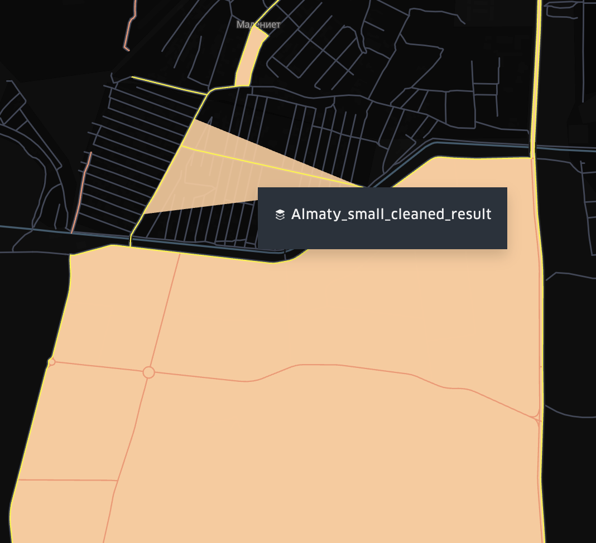

## HGT
HGT is an algorithm that generates the fundamentals of polygons by OSM routes.

### Algorithm
1. Export OSM data using Overpass.
2. Find all intersections:
    1. Bentley-Ottmann sweep-line algorithm O(n log (n + k)).
    2. Brute force O(n^2).
3. Generate polygons:
    1. Currently with bugs: 
    
    
        )

### Visualize
1. Use https://kepler.gl/demo.
    1. Import file from data_samples/polygones_results.
    2. Set color by "color" value.

### TODO:
    [ ] Fix with "bugged: polygones
    [ ] Validation of resulting polygones 
    [ ] All in one script